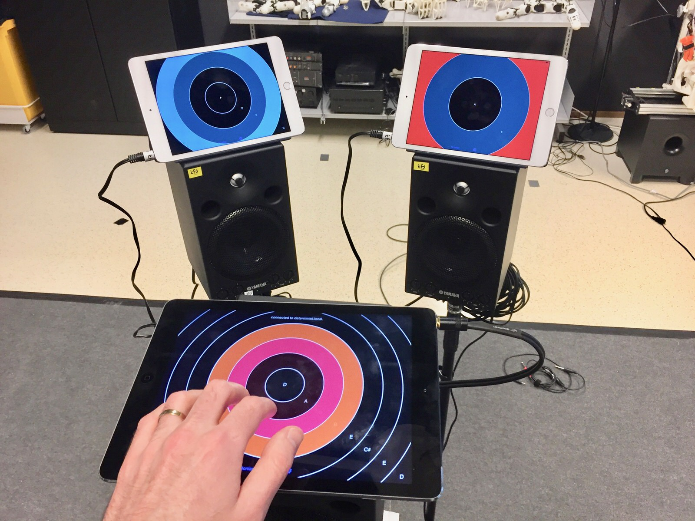

## Interacting with a Neural Touch-Screen Ensemble

### Contact

- Charles Martin
- University of Oslo, Department of Informatics, Oslo, Norway
- +47 920 14 165
- cpm@charlesmartin.com.au

### Description

{ width=300px }

This demo will consist of a four iPads on display for visitors to
interact the neural touch-screen ensemble system. One iPad will be
brought forward into a playing position for performers, while three
others will make up the RNN-generated ensemble performers. Feedback
from the RNN system will be shown on a laptop next to the iPads.

The iPads would best be heard using a set of multimedia speakers, I
can bring a small mixer to combine the signals, but it would be great
if the conference could provide some small speakers.

### Requirements from AudioMostly

- table space
- multimedia speakers
- a power point

