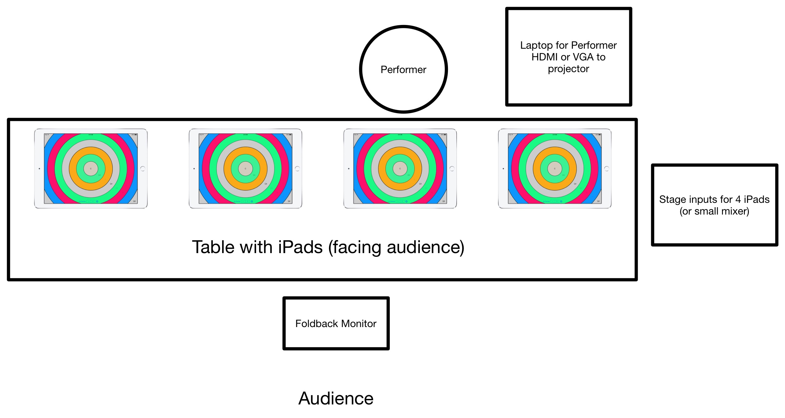

## AudioMostly Music Contribution

- Title: PhaseRings for Mobile Musician and Neural Ensemble 
- Author/Performer: Charles Martin

### Contact

- Charles Martin
- University of Oslo, Department of Informatics, Oslo, Norway
- +47 920 14 165
- cpm@charlesmartin.com.au

This performance consists of a live performer improvising on PhaseRings, a touch-screen app designed for ensemble interaction, with three other computer generated performers. The computer-controlled ensemble is driven by the outputs of a recurrent neural network where the input consists of real-time gestural analyses of the live performer. This performance applies our efforts to model ensemble interactions using a data-driven deep learning approach. The staging emphasises the potential of RNNs to enhance and augment a live-performer and to encode the complexities of collaborative performance. 

This work is an augmented performance experience where a soloist is
accompanied by real-time predictions of an ensemble's likely response.
The neural ensemble model is a real-time application of algorithmic
composition, as the model continually predicts a high-level gestural
transcription for the ensemble which is sonified concatenatively using
a corpus of touch-screen performance recordings.

](neural-ipad-ensemble-demo-screen.jpg){width=300px}

### Demonstration Recording

A studio performance of this work is available on
youtube: [youtu.be/6eg5VSRqIDA](https://youtu.be/6eg5VSRqIDA) and
Dropbox:
[dl.dropboxusercontent.com/u/19370020/videos/NeuralTouchScreenBand-Performance1.zip](https://dl.dropboxusercontent.com/u/19370020/videos/NeuralTouchScreenBand-Performance1.zip).
While the neural ensemble system has not been publicly performed,
PhaseRings has been previous performances in Australia and the USA
from 2014---2016 as part of previous work.

## Program Notes

Musical improvisation in groups is defined by interaction; the
push-and-pull of musical ideas, tensions between competing directions,
and the inexplicable moments where a band finds their groove and,
without warning, falls into coherence. In this ensemble of one live
performer, a recurrent artificial neural network takes the role of the
band. This AI system listens through network messages to the
touch-gestures of the live performer on an iPad screen using the
PhaseRings musical app. The system predicts how an ensemble might
react to this input. The AI system, too, plays iPads, with ensemble
reactions sonified through the same app on three remotely controlled
devices: the neural touch-screen ensemble.

Rather than modelling interaction from the ground up using the rules
of music theory, the neural ensemble is trained using a _data-driven_
approach. From previous research on touch-screen ensemble performance,
we have detailed touch-data recordings of around 150 collaborative
performance sessions. These data include all the drama of live
ensemble improvisation collected over several years of concert and
studio sessions. Parts of this corpus has been used to train the neural
network's responses resulting in a system that draws from 
the same interactive techniques as in the original performances.

This system, and this performance, asks questions about co-creation of
music with a computer system. Is this truly an ensemble performance,
or is it the performance of an enhanced soloist? Is the interaction of
a live improvisation still recognisable in this form? In future, we
hope to develop systems where the AI response could be conditioned on
data from particular performers, so the models could more accurately
predict the response of particular performers. 

## Technical Requirements

- Instrumentation: 4 iPads on stage (one live performer with three computer controlled)
- Extra equipment: Laptop, private wifi-access point.
- Performance length: 5 minutes.
- Stereo direct input for 4 iPads at stage; cables will be provided: 3.5mm headphone to dual mono (TS) 6.25mm jack (5m length).
- Stage foldback
- Projector with input available on stage; the output of the neural network will be visualised for the audience.
- Table or music stands to support ensemble and performer iPads (iPads need to be angled and support to face audience).

## Bio

Charles Martin is a specialist in percussion, computer music, and
interactive media from Australia. With a background in percussion and
mathematics, he emphasises ensemble creativity, collaboration, and
gestural exploration to uncover the hidden affordances of musical and
non-musical objects. Charles focusses on developing new musical
applications on mobile devices that can enhance musical creativity
both on stage and among friends. In his current role in the EPEC
(Engineering Predictability with Embodied Cognition) group at
University of Oslo, he is developing AI technologies for predicting
performer intentions and ensemble responses in mobile music apps.
Charles' works, described as “a thing of rare beauty” in The West
Australian have been performed throughout Australia, Europe and the
USA and presented at international conferences on computer music,
human computer interaction, and percussion. [charlesmartin.com.au](https://charlesmartin.com.au).
